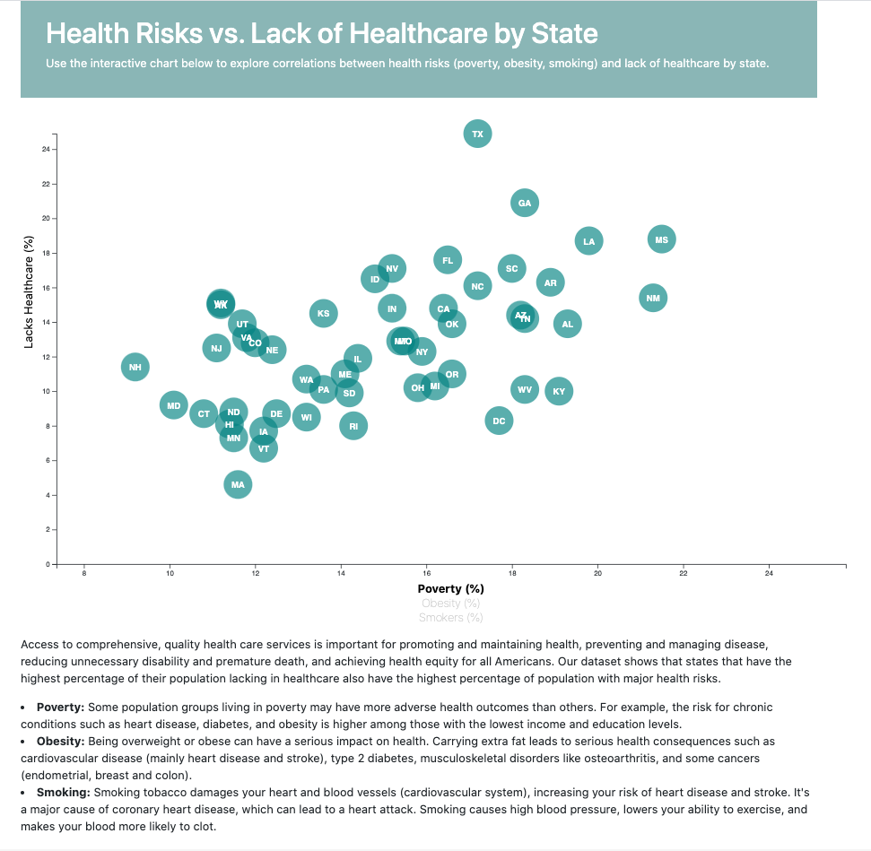

# Project: Health Risks vs. Lack of Healthcare by State

## Objective:
Analyze data from U.S. Census Bureau and the Behavioral Risk Factor Surveillance System to study correlations between demographics and health risks by state. 

## Tools:
* Javascript
* D3 library
* HTML
* CSS
* Bootstrap library

## Assignment: 
* Pull in data from csv
* Create scatter plot between data variables that represents each state with circle elements
* Use click events to change data variables based on user selection
* Add tooltips to reveal specific data when user hovers over a circle element
* Utilize html and css files to showcase interactive graphics

## Website Link:
https://janejanejam.github.io/D3-challenge/

